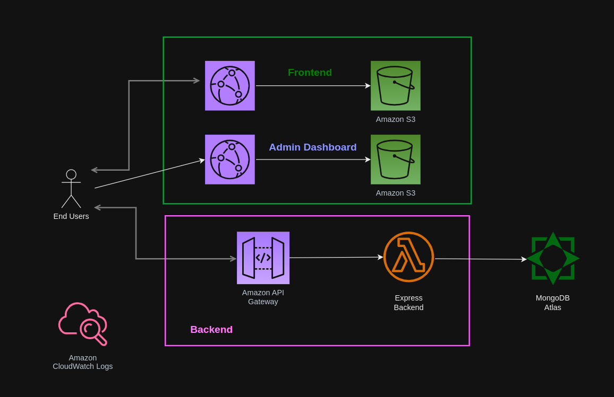

# Ecommerce website with traditional MERN stacks

- 

## Image sources

- Credit to free images from [Pexel](https://www.pexels.com/search/fashion/)

## Notes

- Upgrade to Express v5 and React 19.
- Add validations to address
- Add Inventory management, to avoid over-ordering
- Add server-side pagination and possible infinite query for Admin - Orders
- Add filtering for Admin Orders
- For the sake of simplicity, we use Stripe Test Mode, without Stripe Webhook.
- For Production deployment, we would need to use Stripe webhook to redirect securedly
- We may need to add Express middleware to protect against NoSQL injection
- Certain Backend API is not having Authorization and Isolation between user requests.
- For instance: /verify does not check if orderId belongs to userId. Malicious user may try to inquire about orders, which do not belong to them.
- For Authorization, it is recommended to use either [casbin](https://www.npmjs.com/package/casbin) or [catl](https://github.com/stalniy/casl), with [catl-ability](https://github.com/stalniy/casl/tree/master/packages/casl-ability), [catl-mongoose](https://github.com/stalniy/casl/tree/master/packages/casl-mongoose) for MongoDB, or [catl-prisma](https://github.com/stalniy/casl/tree/master/packages/casl-ability) for SQL databases.

## Stripe Test Credit cards

- [Use dummy Stripe credit card](https://docs.stripe.com/testing)
- (US) 4242 4242 4242 4242.
- (CAD$) 4000 0012 4000 0000
- Use a valid future date, such as 12/34.
- Use any three-digit CVC (four digits for American Express cards).

## Admin Dashboard Login

- User: `admin@fashionify.com`, Password: `Password123`
