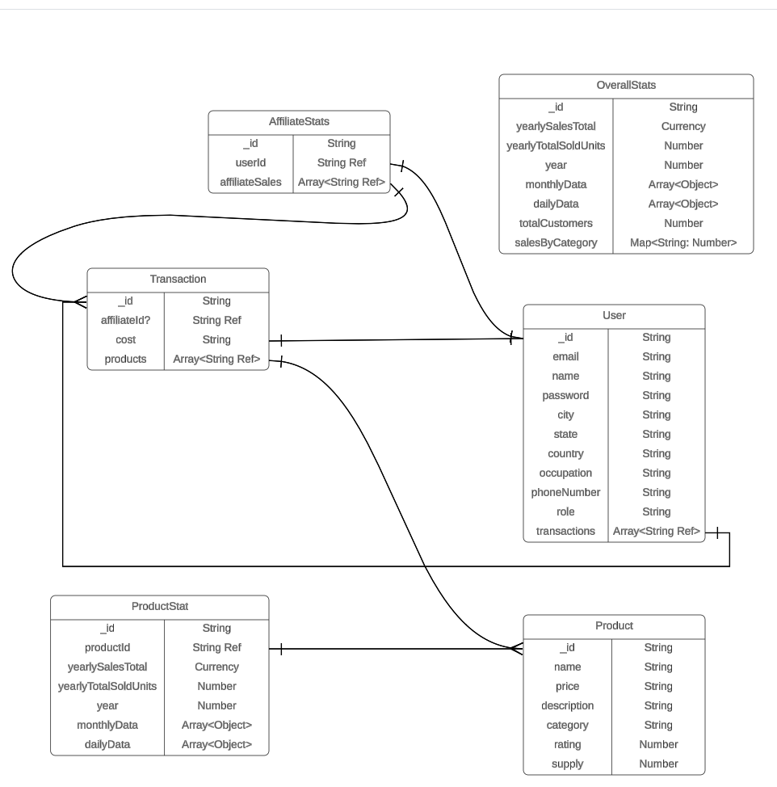

# Backend for Admin Dashboard

## Express Typescript Scalfolding

- [Guideline 1](https://blog.logrocket.com/how-to-set-up-node-typescript-express/)
- [Guideline 2](https://kinsta.com/blog/express-typescript/)

```bash
npm init -y
npm i express
npm install -D @types/express @types/node typescript
npx tsc --init
```

- Change the `OutDir` properties

```tsconfig.json
  "compilerOptions": {
    ...
    "outDir": "./dist"
    ...
  }
```

## MongoDB Relationship Model with Lucid Chart


