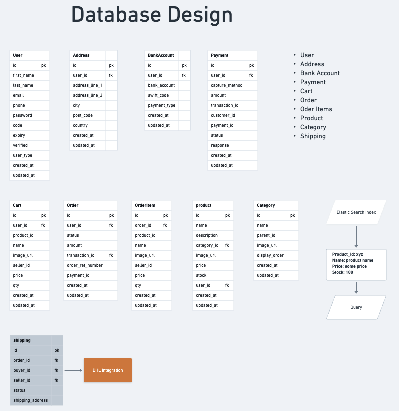
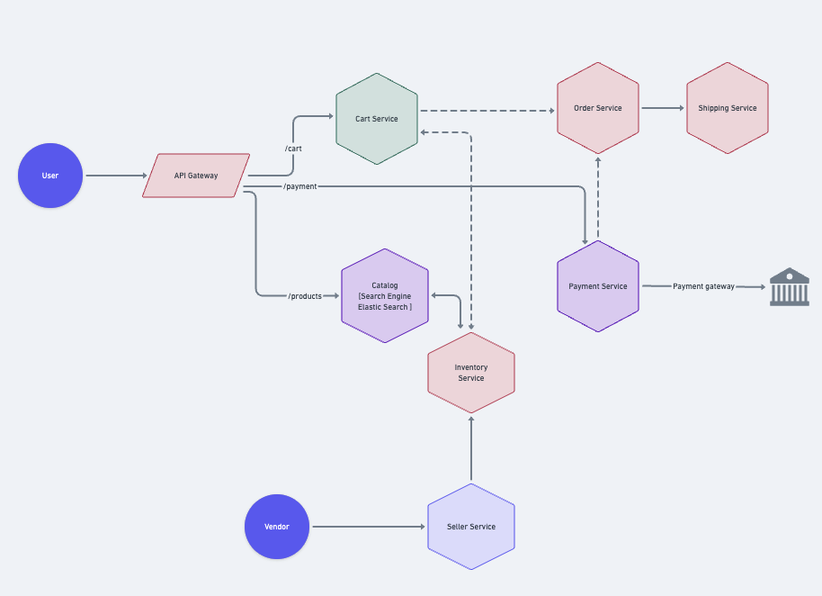

# Golang ecom project

## Basic Golang commands

```zsh
    go mod init <Module_Name>
    go mod tidy
    go mod download
    go run *.go
```

## Starting watched server

```zsh
    # Install Air once (adds to GOPATH/bin):
    go install github.com/air-verse/air@latest

    # Start dev server with live reload
    make server
```

## Install dependencies

```zsh
    go get -u gorm.io/gorm
    go get -u gorm.io/driver/postgres
    go get github.com/golang-jwt/jwt/v4
```

## Architecture



